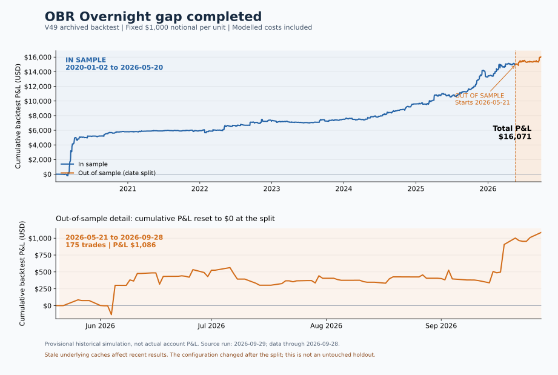

# OBR Overnight gap completed

This source snapshot contains the current backtest and Interactive Brokers live
runner. It describes a strategy under test. The configuration and known live /
backtest differences are documented in
[STRATEGY_SPEC.md](orb-live-trading/STRATEGY_SPEC.md). The older README performance
tables are deliberately absent: they describe earlier configurations.

The ETF's own leveraged gap selects candidates; a prior-session filter uses
open-to-close moves for equities and close-to-close moves for 24-hour assets.
After a 30-minute opening range, entries follow the gap through the boundary.
The stop is the opposite boundary and the target is two opening ranges away.
Sizing uses class weights, SPY's gap regime, and margin limits.

## Backtest P&L: in sample and out of sample



| Period | Dates | Trades | Fixed-notional P&L |
|---|---|---:|---:|
| In sample | 2020-01-02 to 2026-05-20 | 1,601 | $14,985.15 |
| Out of sample (date split) | 2026-05-21 to 2026-09-28 | 175 | $1,085.93 |
| Full sample | 2020-01-02 to 2026-09-28 | 1,776 | $16,071.08 |

This is an **archived, provisional simulation**, using fixed $1,000 notional
per sizing unit with modelled costs. It is not actual account P&L. The curve
uses the 2026-09-29 V49 run; underlying caches were stale near its end.
The V48/V49 configuration changed after the split date, so the orange period
is not an untouched out-of-sample validation of the final configuration.
The second panel resets P&L to zero at the split to show that period clearly.

Only aggregated daily simulation P&L is published, in
[pnl_daily.csv](docs/charts/pnl_daily.csv), with
[provenance](docs/charts/pnl_provenance.json). Rebuild the SVG with
`python plot_pnl.py` after installing matplotlib. Raw trade logs and live
account performance remain private.

## Setup

Python 3.11 or later is required for the runner. Backtest dependencies are pinned
in `BacktestingGaps/requirements.txt`; use Python 3.13 for the recorded research
environment. Keep the two directories alongside one another.

```sh
python -m venv .venv
# Windows: .venv\Scripts\Activate.ps1
# macOS/Linux: source .venv/bin/activate
python -m pip install -e ./orb-live-trading[dev]
python -m pip install -r BacktestingGaps/requirements.txt
python verify_snapshot.py
cd orb-live-trading
python -m orb_live.runner.main --help
```

Paper sessions require your own IB Gateway/TWS running locally, enabled API
access, and market data subscriptions. Configure a private `.env` from the
example. The default paper port is 4002; TWS users may need to override the port.

```sh
python -m orb_live.runner.main --paper
```

`verify_snapshot.py` tests the exported runner, canonical backtest imports,
configuration and backtest annualization constants. It explicitly deselects
recorded account-session tests. The other backtest statistics / calendar tests
need the excluded licensed SPY cache; restore your own data to run them separately.

The source snapshot includes no account records, market data caches, broker
credentials, session fixtures, or Git history. Historical data access must be
arranged separately. Never publish your working trading directory or its Git
history as a substitute for this snapshot.

## Canonical backtest

From `BacktestingGaps`, run `python analysis/freeze_run.py`. Its imported locked
configuration is the V48 configuration with the V49 prior-session definition.
Do not substitute `analysis/authoritative_run.py`'s main entry point.

Supply your licensed market data as parquet files:

- `orb_event_study/cache/intraday/<ETF>/<YYYY-MM>.parquet`: timestamp, open,
  high, low, close, volume; regular-session one-minute bars.
- `orb_event_study/cache/daily/<UNDERLYING>.parquet`: date or timestamp plus
  open, high, low, close, volume. Inspect the loaders for indexing conventions.
- The SPY daily cache supplies the session calendar and regime calculation.
  Missing sessions or stale underlying bars invalidate recent comparisons.
- `orb_event_study/cache/etf_daily_ibkr/<ETF>.parquet`: date and official close;
  the engine falls back to the last intraday close if this cache is absent.
- `analysis/out/splits_history.json`: split ratios used to undo adjusted prices
  for sibling ranking. Missing split histories silently change that ranking.

The calibration coefficients and universe/sigma tables are included as strategy
inputs. Raw fills and calibration account records are excluded. Data caches and
generated outputs remain private by default. A full numerical reproduction
requires the same inputs, data provenance and cutoff as the original run; this
source-only release does not certify that reproduction.

See [release notes](RELEASE_NOTES.md) and the
[blog research checklist](BLOG_RESEARCH.md) before quoting performance.
